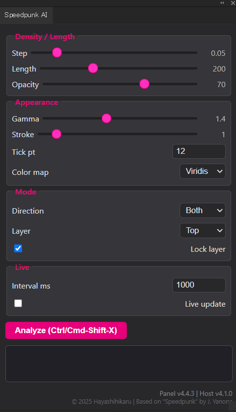

# Speedpunk AI — Illustrator 2024 extension
Interactive curvature-comb visualiser rebuilt from
[yanone/speedpunk](https://github.com/yanone/speedpunk).


### Features
* Live curvature combs with gamma & stroke scaling  
* Straight-segment ticks auto-fill the segment  
* Heat-map colour presets (viridis / magma / gray-→-red …)  
* Heavy >1 s auto-stop safety

---

## 0 | Quick Start (English)

| Step | Action |
|------|--------|
| **1** | Copy the entire `SpeedpunkIllustrator2024/` folder to:<br>• macOS → `~/Library/Application Support/Adobe/CEP/extensions/`<br>• Windows → `%APPDATA%\Adobe\CEP\extensions\` |
| **2** | Enable unsigned extensions (once):<br>mac `defaults write com.adobe.CSXS.11 PlayerDebugMode 1`<br>Win Registry → `HKCU\Software\Adobe\CSXS.11 → DWORD PlayerDebugMode=1` |
| **3** | Restart Illustrator 2021-2024 (CEP 11).<br>Open **Window ▶ Extensions ▶ Speedpunk AI** |
| **4** | Select *exactly one* path/compound path, press **Analyze** or toggle **Live**. |
| Heavy-safety | If analysis takes > 1 s, Live stops automatically. Raise **Step** (density) until Live can be re-enabled. |

### Basic controls (panel)
* **Step** – sampling density (smaller = more combs)  
* **Length** – global comb scale factor  
* **Gamma** – heat-map steepness  
* **Tick pt** – straight-segment tick spacing  
* **Color map** – preset palettes (Rainbow, Viridis, Gray→Red, etc.)  
* **Direction / Layer / Lock** – where and how combs are drawn  
* **Live** – auto-refresh every _Interval ms_ for interactive editing



---

## 1 | Prerequisite file – `CSInterface.js`
This panel is a CEP (Common Extensibility Platform) extension and needs  
**`CSInterface.js`** to talk to Illustrator.

1. Download the official file from the Adobe-CEP GitHub repo:  
   <https://github.com/Adobe-CEP/CEP-Resources/tree/master/CEP_11.x/CSXS>  
   → **Right-click “CSInterface.js” ▶ Save As…**
2. Copy the file into your extension folder **`SpeedpunkIllustrator2024/`**  
   (same level as `index.html`, `panel.js`, `style.css`).

Folder layout should now look like

If the panel is still not listed, confirm that
CSInterface.js is present and that the folder name matches the ExtensionBundleId in manifest.xml.

```
└─ (User CEP folder)
   └─ SpeedpunkIllustrator2024/
      ├─ CSXS/manifest.xml
      ├─ CSInterface.js   ← downloaded from Adobe-CEP repo
      ├─ panel.js
      ├─ index.html
      ├─ style.css
      └─ jsx/host.jsx
```

---

## Developer-mode (unsigned) Setup

> Adobe CEP will *refuse* to load an unsigned extension unless “PlayerDebugMode”  
> is turned on **per machine**.  
> Run **one** of the scripts below *once* and restart Illustrator.

### macOS `enable_debug.command`

```bash
#!/bin/bash
# -------------------------------
# Enable unsigned CEP extensions
# -------------------------------
CSXS_VER="11"
defaults write "com.adobe.CSXS.$CSXS_VER" PlayerDebugMode 1
echo "✅ PlayerDebugMode set to 1 for CSXS $CSXS_VER"
echo "Restart Illustrator to load unsigned extensions."
```

### Windows enable_debug.bat
```bat
@echo off
:: Enable unsigned CEP extensions (CSXS 11)
SET CSXS_VER=11
REG ADD "HKCU\Software\Adobe\CSXS.%CSXS_VER%" ^
    /v PlayerDebugMode /t REG_DWORD /d 1 /f
echo.
echo ✅ PlayerDebugMode set to 1 for CSXS %CSXS_VER%
echo Restart Illustrator to load unsigned extensions.
pause
```
Right-click ▶ “Run as Administrator” (not strictly required, but safer).

### 🛑 Security notice  
PlayerDebugMode = 1 disables Adobe’s signature check for all CEP panels
on your system. 

Malicious ZXP/extension code could run with full scripting rights
inside Illustrator, Photoshop, InDesign, etc.

Only install extensions you trust or built yourself.

Switch it off again when you no longer need dev-mode:

```bash
# mac
defaults delete com.adobe.CSXS.11 PlayerDebugMode
# Windows
REG DELETE "HKCU\Software\Adobe\CSXS.11" /v PlayerDebugMode /f
```

---

## 2 | 操作ガイド (日本語)

| 手順 | 操作 |
|------|------|
| **1** | `SpeedpunkIllustrator2024` フォルダを<br>mac `~/Library/Application Support/Adobe/CEP/extensions/`<br>Win `%APPDATA%\Adobe\CEP\extensions\` へコピー |
| **2** | 署名なし拡張を有効化（初回のみ）<br>mac `defaults write com.adobe.CSXS.11 PlayerDebugMode 1`<br>Win レジストリ `PlayerDebugMode=1` |
| **3** | Illustrator を再起動 → **ウィンドウ ▶ エクステンション ▶ Speedpunk AI** |
| **4** | パス／複合パスを 1 つ選択し **Analyze** ボタン、または **Live** を ON |

### パネルの主な項目
| 項目 | 説明 |
|------|------|
| **Step (density)** | 曲率サンプリング間隔。小さいほど comb が密 |
| **Length scale** | comb 全体の長さ倍率 |
| **Gamma** | ヒートマップの色勾配 |
| **Tick pt** | 直線区間のチック間隔 |
| **Color map** | カラープリセット (虹 / Viridis / 灰→黄→赤 / 緑→黄→赤 / 黒紫黄赤) |
| **Direction** | comb を内側・外側・両側に描画 |
| **Layer position** | 表示レイヤーを最前面 / 最背面 |
| **Lock layer** | 描画後に `_SpeedpunkCurvature` をロック |
| **Live** | 指定間隔で自動再解析。解析が 1 秒超なら自動停止 |

> **注:** 解析に 1 秒以上かかった場合 Live は自動オフになり、  
> **Step** を大きく（密度を下げて）再度 Live を ON してください。

---

## 3 | Credits & License
© 2025 Hayashihikaru
Based on “Speedpunk” original algorithm (© 2012 J. Yanone)

Code licensed under the Apache License 2.0.
See LICENSE and NOTICE for details.


